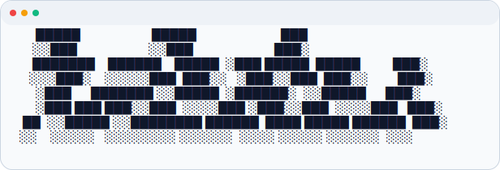

<p align="center">
  <picture>
    <source srcset="assets/logo/svg/banner-dark.svg" media="(prefers-color-scheme: dark)">
    <source srcset="assets/logo/svg/banner-light.svg" media="(prefers-color-scheme: light)">
    
  </picture>
</p>

# dot-tasks

`dot-tasks` is a Python CLI/TUI task manager designed to be readable by both humans and AI agents.

## Installation

### End-User Install (from Git)

Install directly into your current Python environment:

```bash
pip install "git+https://github.com/<org-or-user>/dot-tasks.git"
```

After install:

```bash
dot-tasks --help
```

### Development Install (with uv)

```bash
git clone https://github.com/awni00/dot-tasks.git
cd dot-tasks
uv sync --dev
uv run dot-tasks --help
```

Alternative editable development install:

```bash
uv pip install -e ".[dev]"
```

Once the package is published to PyPI, this section can also include a simple `pip install dot-tasks`.

## Quick Start

```bash
dot-tasks init
dot-tasks create add-task-manager --summary "Build initial package"
dot-tasks start add-task-manager
dot-tasks update add-task-manager --note "Implemented storage layer"
dot-tasks complete add-task-manager
```

## Task Layout

```text
.tasks/
  todo/
  doing/
  done/
  trash/
```

Each task lives in `.tasks/<status-bucket>/<created-date>-<task_name>/` and contains:

- `task.md` (canonical metadata frontmatter + task body)
- `activity.md` (append-only audit log)
- `plan.md` (created when the task is started)
- `config.yaml` (interactive mode preferences)

## Commands

- `dot-tasks init`
- `dot-tasks create <task_name>`
- `dot-tasks start <task_name>`
- `dot-tasks complete <task_name>`
- `dot-tasks list [todo|doing|done] [--json]`
- `dot-tasks view <task_name> [--json]`
- `dot-tasks update <task_name> ...`
- `dot-tasks rename <task_name> <new_task_name>`
- `dot-tasks delete <task_name> [--hard]`

### Interaction Modes

`dot-tasks` supports explicit interaction mode selection with `--mode off|prompt|full`:

- `off`: non-interactive only
- `prompt`: interactive prompt menus/forms
- `full`: full-screen Textual UI when available (falls back to prompt)

Mode precedence:

- CLI `--mode` override wins.
- Otherwise, `.tasks/config.yaml` value is used (`settings.interactive_mode`).
- Invalid config values produce a warning and fall back to `prompt`.

`dot-tasks init` creates `.tasks/config.yaml`. In interactive terminals it asks for mode; in non-interactive contexts it defaults to `prompt`.

Behavior:

- `dot-tasks` (no command):
  - `prompt`/`full`: opens interactive command shell
  - `off`: prints help + explicit error and exits non-zero
- `dot-tasks <command>`:
  - if required args are missing and mode is `prompt` or `full`, opens interactive command flow and exits after completion
  - if required args are provided, runs non-interactive command path

## Interactive Demo

See the pre-populated walkthrough in:

- `examples/basic-demo/README.md`
